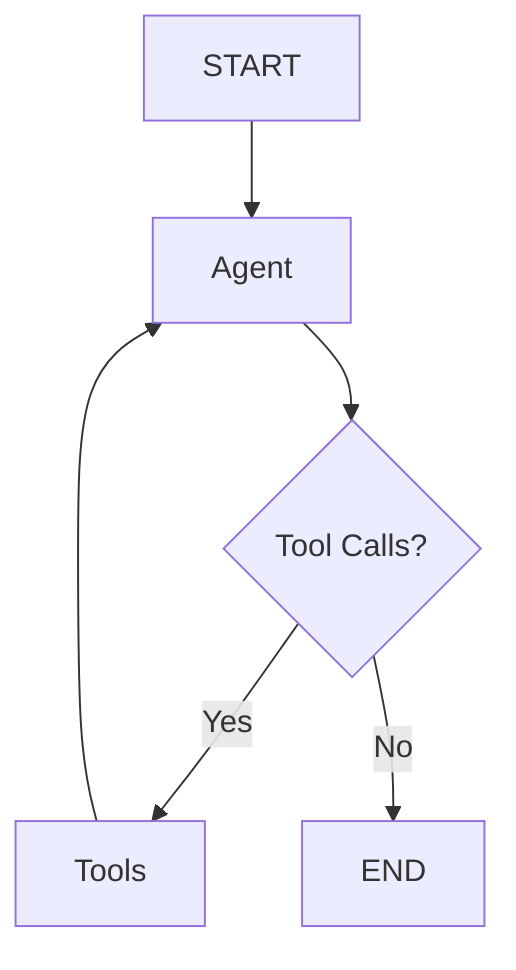
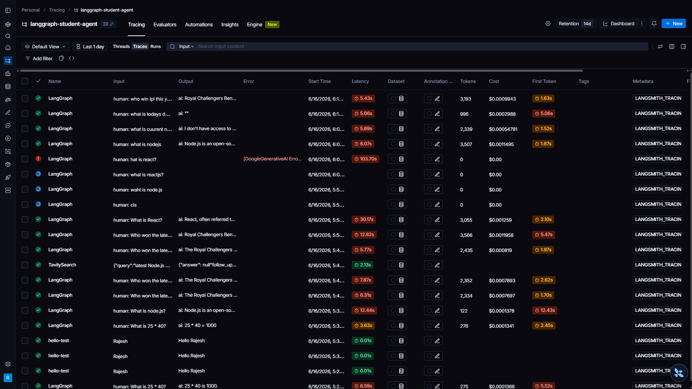

# LangGraph Tool-Calling Agent

An agentic AI assistant built with LangGraph that routes questions to tools (calculator, web search) or answers directly — powered by Gemini 2.5 Flash.

## Overview

A LangGraph agent that routes queries through a `StateGraph` with two nodes — **Agent** (Gemini) and **Tools** (calculator, search) — connected by a conditional edge. The agent loops until the model produces a response with no tool calls, then reaches `END`.

## Features

- **Calculator Tool** — Evaluates mathematical expressions via a safe sandboxed function
- **Web Search Tool** — Fetches real-time information via Tavily Search (LangChain partner)
- **Conditional Tool Routing** — The model autonomously decides when to call a tool vs. answer directly
- **LangSmith Tracing** — End-to-end observability into every node execution and LLM call
- **Interactive CLI** — Read-eval-print loop with full message history

## Architecture



The graph compiles into a single runnable instance. The agent node calls Gemini with bound tools; if the response contains tool calls, the conditional edge routes to the tools node, which executes them and loops back to the agent. Otherwise it reaches `END`.

## Tech Stack

- **TypeScript** — Fully typed, ES2022 target, strict mode
- **LangGraph** — StateGraph, nodes, edges, conditional routing, ToolNode
- **LangChain** — Message abstractions, tool interface, model bindings
- **Gemini 2.5 Flash** — Fast, cost-effective LLM via Google AI Studio
- **Tavily Search** — AI-optimized search API (official LangChain partner)
- **LangSmith** — Distributed tracing and observability
- **Zod** — Runtime schema validation for tool inputs

## Project Structure

```
src/
├── config/          # Gemini model initialization
├── graph/           # StateGraph definition + conditional router
├── nodes/           # Agent node (LLM call) + ToolNode (tool execution)
├── state/           # Shared state (MessagesAnnotation)
├── tools/           # Calculator tool + Tavily search tool
├── index.ts         # CLI entry point
├── test-langsmith.ts    # LangSmith tracing smoke test
└── test-tavily.ts       # Tavily API connectivity test
```

Clean separation of concerns: state, graph topology, node logic, and tool implementations are independently modular. Adding a new tool requires only a file in `tools/` and registering it in the tools index.

## How It Works

1. A user submits a question via the CLI
2. The **Agent Node** sends the conversation (system prompt + history) to Gemini
3. Gemini decides: answer directly or call a tool (calculator / search)
4. If a tool is requested, the **Router** sends execution to the **Tool Node**
5. The tool result is appended to the message history and fed back to the Agent
6. Steps 2–5 repeat until no tool calls remain — the final answer is returned

## Setup

**Prerequisites:** Node.js 18+ (ES2022 target)

```bash
npm install
cp .env.example .env   # Add GOOGLE_API_KEY, TAVILY_API_KEY, LANGSMITH_API_KEY
npm run dev
```

| Command | Description |
|---------|-------------|
| `npm run dev` | Run agent in dev mode via `tsx` |
| `npm run build` | TypeScript compile to `dist/` |
| `npm start` | Run compiled production build |

## Example Queries

```
You: What is 456 * 23?
Agent: Result: 10488

You: Who won the latest IPL final?
Agent: The 2025 IPL final was won by the Chennai Super Kings...

You: What is React?
Agent: React is a JavaScript library for building user interfaces...

You: What is 2 + 2?
Agent: 4

You: What is the latest Node.js version?
Agent: The latest stable version is v22.x...
```

## LangSmith Trace

Every agent invocation is traced end-to-end in LangSmith. You can inspect each node execution, tool call, and LLM response — including latency, token usage, and the exact messages passed between nodes. This is invaluable for debugging agent behavior and optimizing prompts.



## What I Learned

- **StateGraph** — Define a typed graph with shared state across all nodes
- **MessagesAnnotation** — Built-in message list state management via LangGraph
- **Nodes** — Agent node (LLM invocation) and Tools node (tool execution)
- **Edges** — Connect START and END to nodes
- **Conditional Routing** — `addConditionalEdges` dynamically selects the next node based on model output
- **ToolNode** — Prebuilt LangGraph node that invokes bound tools
- **Tool Calling** — `model.bindTools()` enables the LLM to select and call tools
- **Agent Loop Pattern** — Agent → Tools → Agent → … → END until complete
